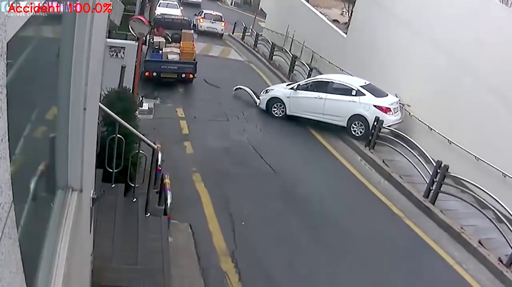

# Accident-detection-system-using-Flask

<h3> The dataset is taken from kaggle : https://www.kaggle.com/datasets/ckay16/accident-detection-from-cctv-footage</h3>

<h3>You Can train model using data from kaggle, i already uploaded "road-accident-detection.ipynb" for train the model </h3>
<h5> here is link for download trained model:  https://drive.google.com/file/d/1RgK3zSAC7E0BpKxyR8TisxWWkTdYrGpf/view?usp=sharing </h5>

<h3>Here is Output of project:<h3>
  
  <h4>Here is SS of SMS Alert: </h4>
  
  
<h6>Good Luck</h6>
